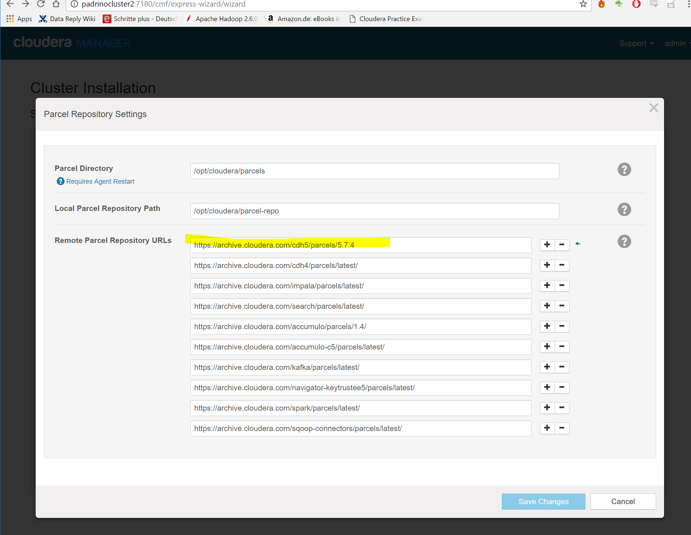
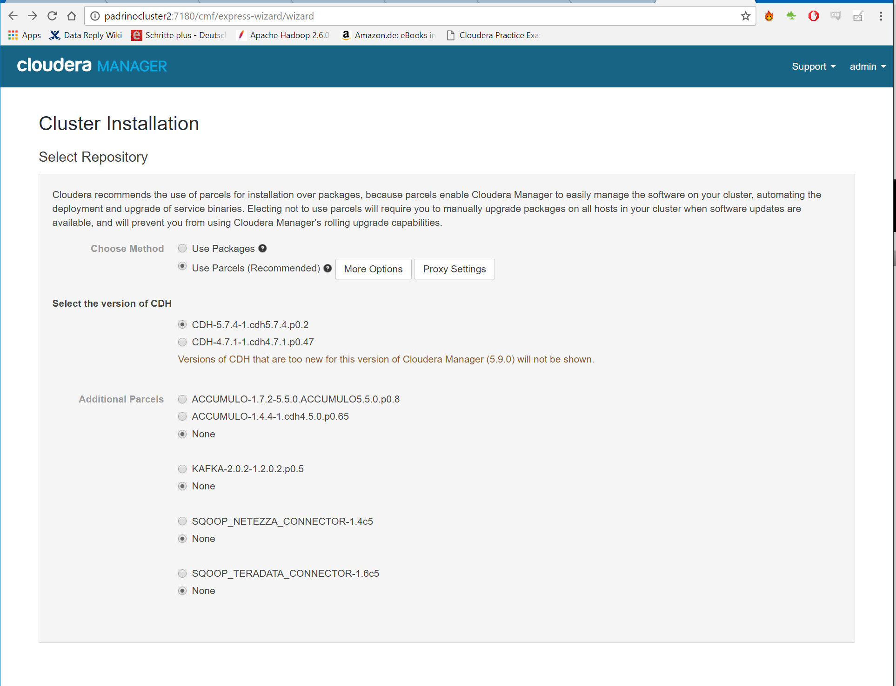
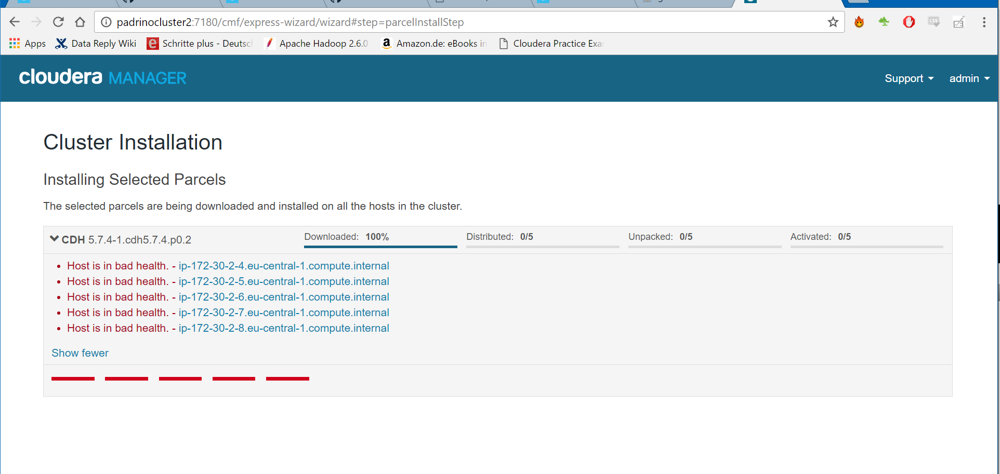
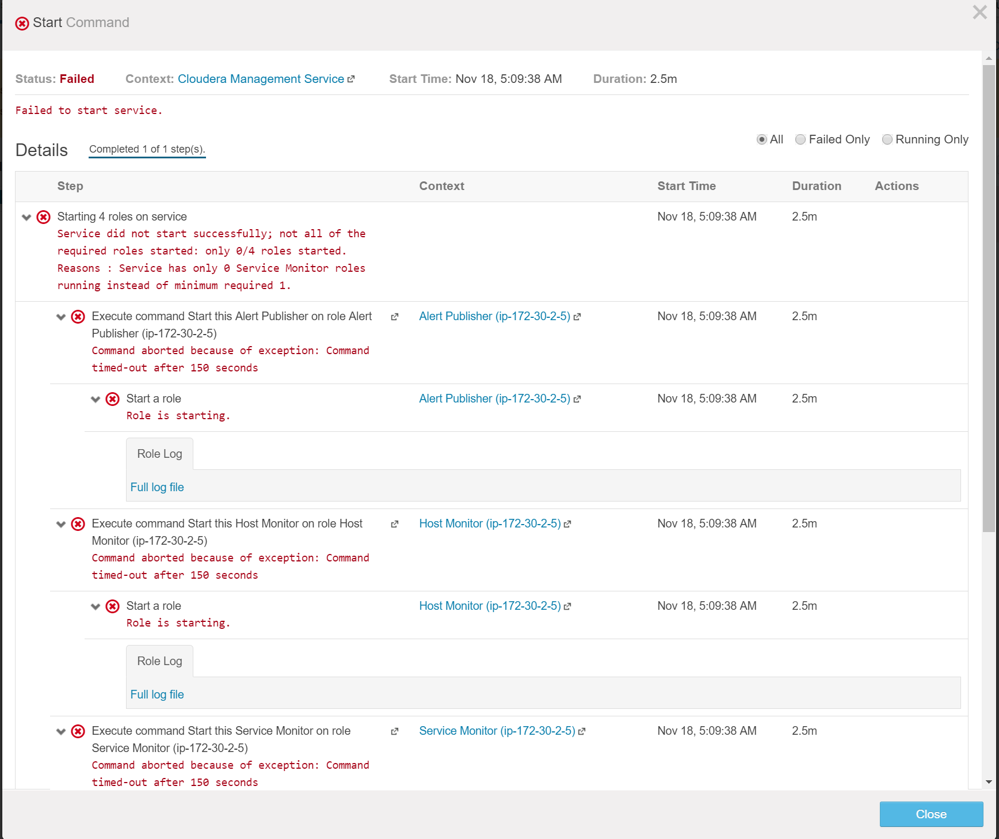
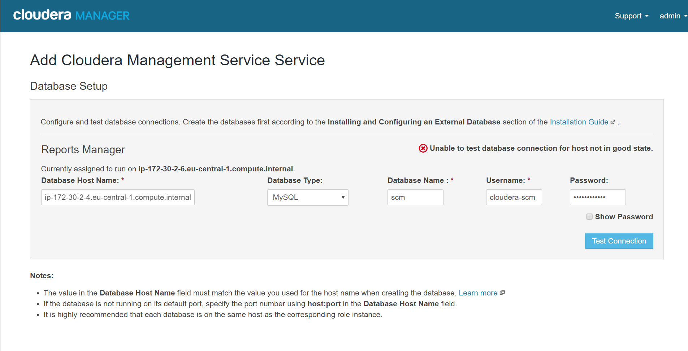
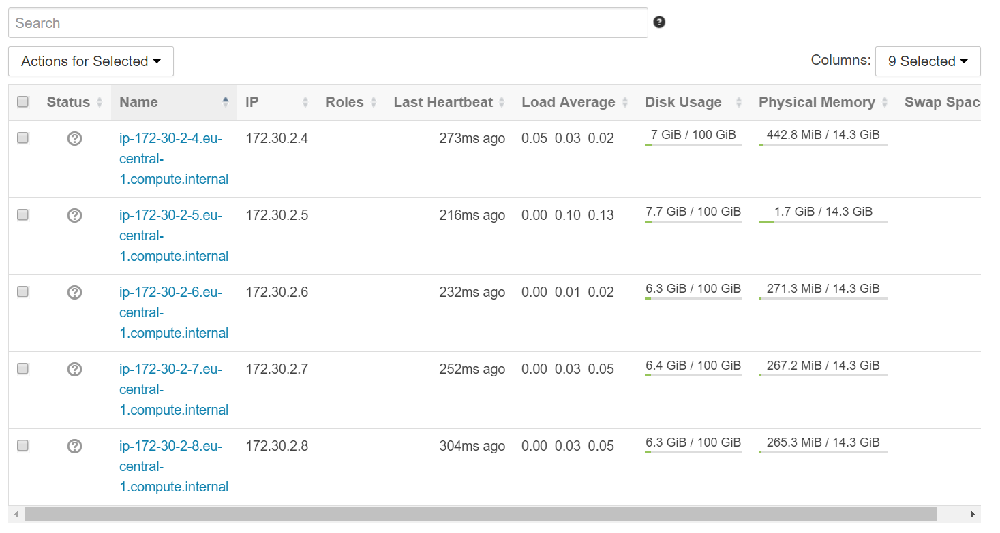

The first step is to add the parcel repo:


Then select the version to install:


While installing the parcels for cloudera 5.7.4 got the following error:


## Issue
After installing cloudera manager and deploying the agents, the following error was present on every agent log:
```
[18/Nov/2016 04:49:52 +0000] 27310 MainThread agent        ERROR    Heartbeating to localhost:7182 failed.
Traceback (most recent call last):
  File "/usr/lib64/cmf/agent/build/env/lib/python2.7/site-packages/cmf-5.9.0-py2.7.egg/cmf/agent.py", line 1349, in _send_heartbeat
    self.master_port)
  File "/usr/lib64/cmf/agent/build/env/lib/python2.7/site-packages/avro-1.6.3-py2.7.egg/avro/ipc.py", line 469, in __init__
    self.conn.connect()
  File "/usr/lib64/python2.7/httplib.py", line 807, in connect
    self.timeout, self.source_address)
  File "/usr/lib64/python2.7/socket.py", line 571, in create_connection
    raise err
error: [Errno 111] Connection refused
[18/Nov/2016 04:49:52 +0000] 27310 MainThread agent        INFO     Loading last saved hb response to complete initialization: /var/lib/cloudera-scm-agent/response.avro
[18/Nov/2016 04:49:52 +0000] 27310 MainThread heartbeat_tracker INFO     HB stats (seconds): num:1 LIFE_MIN:0.01 min:0.01 mean:0.01 max:0.01 LIFE_MAX:0.01
[18/Nov/2016 04:49:52 +0000] 27310 MainThread agent        INFO     CM server guid: 7db4fd55-d8e6-497e-b584-2efbaf9a800c
[18/Nov/2016 04:49:52 +0000] 27310 MainThread agent        INFO     Using parcels directory from server provided value: /opt/cloudera/parcels
[18/Nov/2016 04:49:52 +0000] 27310 MainThread parcel       INFO     Agent does create users/groups and apply file permissions
[18/Nov/2016 04:49:52 +0000] 27310 MainThread downloader   INFO     Downloader path: /opt/cloudera/parcel-cache
[18/Nov/2016 04:49:52 +0000] 27310 MainThread parcel_cache INFO     Using /opt/cloudera/parcel-cache for parcel cache
[18/Nov/2016 04:49:52 +0000] 27310 MainThread agent        ERROR    Caught unexpected exception in main loop.
Traceback (most recent call last):
  File "/usr/lib64/cmf/agent/build/env/lib/python2.7/site-packages/cmf-5.9.0-py2.7.egg/cmf/agent.py", line 758, in start
    self._init_after_first_heartbeat_response(resp_data)
  File "/usr/lib64/cmf/agent/build/env/lib/python2.7/site-packages/cmf-5.9.0-py2.7.egg/cmf/agent.py", line 938, in _init_after_first_heartbeat_response
    self.client_configs.load()
  File "/usr/lib64/cmf/agent/build/env/lib/python2.7/site-packages/cmf-5.9.0-py2.7.egg/cmf/client_configs.py", line 682, in load
    new_deployed.update(self._lookup_alternatives(fname))
  File "/usr/lib64/cmf/agent/build/env/lib/python2.7/site-packages/cmf-5.9.0-py2.7.egg/cmf/client_configs.py", line 432, in _lookup_alternatives
    return self._parse_alternatives(alt_name, out)
  File "/usr/lib64/cmf/agent/build/env/lib/python2.7/site-packages/cmf-5.9.0-py2.7.egg/cmf/client_configs.py", line 444, in _parse_alternatives
    path, _, _, priority_str = line.rstrip().split(" ")
ValueError: too many values to unpack
[18/Nov/2016 04:49:53 +0000] 27310 MainThread agent        INFO     Loading last saved hb response to complete initialization: /var/lib/cloudera-scm-agent/response.avro
[18/Nov/2016 04:49:53 +0000] 27310 MainThread agent        INFO     CM server guid: 7db4fd55-d8e6-497e-b584-2efbaf9a800c
[18/Nov/2016 04:49:53 +0000] 27310 MainThread agent        INFO     Using parcels directory from server provided value: /opt/cloudera/parcels
[18/Nov/2016 04:49:53 +0000] 27310 MainThread parcel       INFO     Agent does create users/groups and apply file permissions
[18/Nov/2016 04:49:53 +0000] 27310 MainThread parcel_cache INFO     Using /opt/cloudera/parcel-cache for parcel cache
[18/Nov/2016 04:49:53 +0000] 27310 MainThread agent        ERROR    Caught unexpected exception in main loop.
Traceback (most recent call last):
  File "/usr/lib64/cmf/agent/build/env/lib/python2.7/site-packages/cmf-5.9.0-py2.7.egg/cmf/agent.py", line 758, in start
    self._init_after_first_heartbeat_response(resp_data)
  File "/usr/lib64/cmf/agent/build/env/lib/python2.7/site-packages/cmf-5.9.0-py2.7.egg/cmf/agent.py", line 938, in _init_after_first_heartbeat_response
    self.client_configs.load()
  File "/usr/lib64/cmf/agent/build/env/lib/python2.7/site-packages/cmf-5.9.0-py2.7.egg/cmf/client_configs.py", line 682, in load
    new_deployed.update(self._lookup_alternatives(fname))
  File "/usr/lib64/cmf/agent/build/env/lib/python2.7/site-packages/cmf-5.9.0-py2.7.egg/cmf/client_configs.py", line 432, in _lookup_alternatives
    return self._parse_alternatives(alt_name, out)
  File "/usr/lib64/cmf/agent/build/env/lib/python2.7/site-packages/cmf-5.9.0-py2.7.egg/cmf/client_configs.py", line 444, in _parse_alternatives
    path, _, _, priority_str = line.rstrip().split(" ")
ValueError: too many values to unpack
```


Proceeded to readd the management server and then recreate the cluster.

Added the management services but it takes forever to start, no logs are available


Proceeding to reinstall everything.

Deleted cloudera management service and tried to redeploy them and didn't work.

Reinstalled everything everywhere:
```
sudo yum install -y cloudera-manager-server
ansible all -a "sudo yum install -y cloudera-manager-agent cloudera-manager-daemons"
ansible all -a 'sudo sed -i "s/server\_host=localhost/server_host=ip-172-30-2-5.eu-central-1.compute.internal/'
ansible all -a "sudo service cloudera-scm-agent restart"
sudo service cloudera-scm-server restart
```

After restarting it's still not possible to start host monitor and everything because of following error:


Checking the agent logs, the error is still the same but they're hearthbeating:


But it's still not possible to test the database connection.