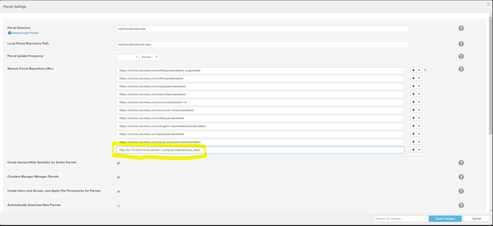

## Create a Local Repository
The local repository is installed on the last node of the cluster (padrinocluster5).
To install it, simply start the httpd daemon and enable auto startup:
```
[ec2-user@ip-172-20-0-8 ~]$ sudo service httpd start
[ec2-user@ip-172-20-0-8 ~]$ sudo chkconfig httpd on
```
Once the daemon is started, create the local repo folder using the following command:
```
[ec2-user@ip-172-20-0-8 ~]$ sudo mkdir /var/www/html/local_repo
```

And add the local repository to cloudera manager parcel configuration:


To add new parcels to the repo, simply stop the httpd daemon, copy the `.parcel` file in the folder `/var/www/html/local_repo` and create a `manifest.json` file containing all the information regarding the locally available parcels. Once the daemon is restarted, all the parcels will be available from cloudera manager.