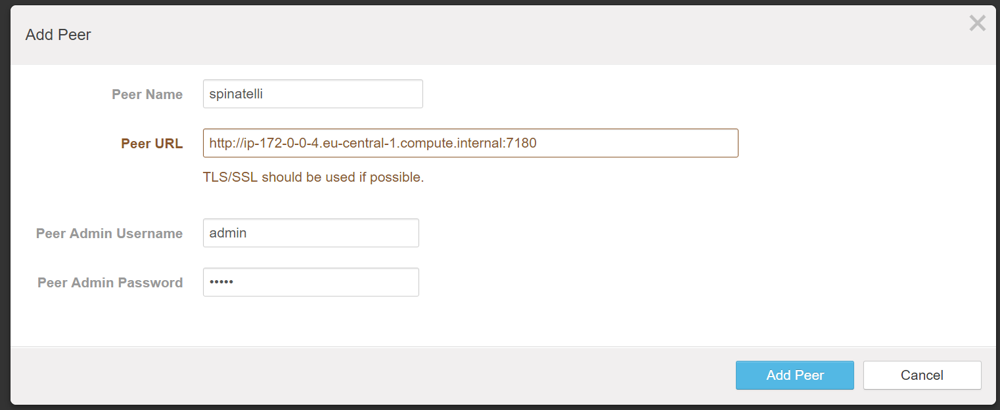
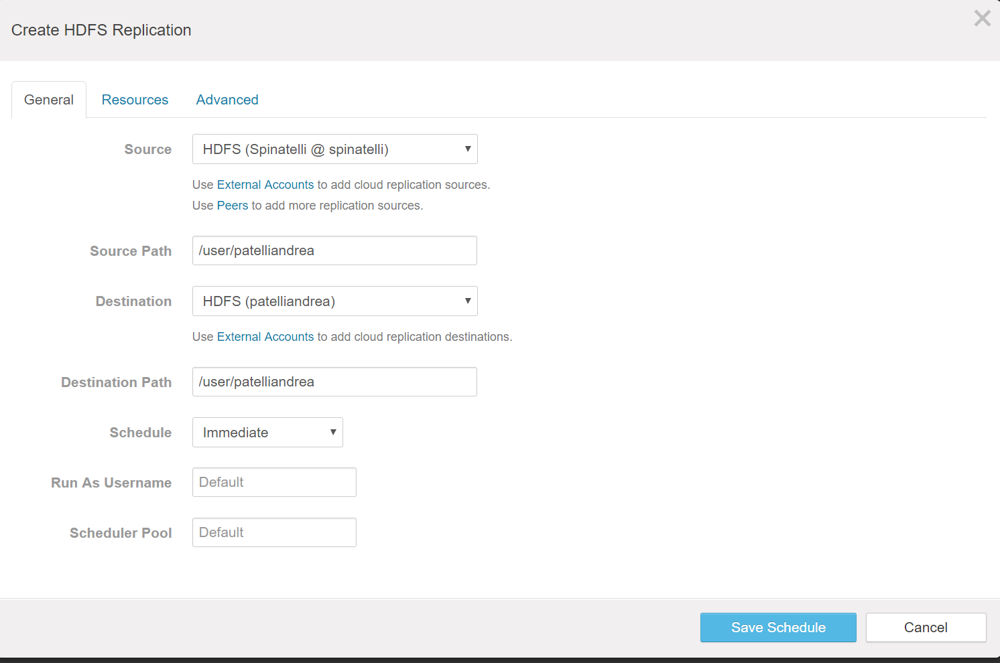
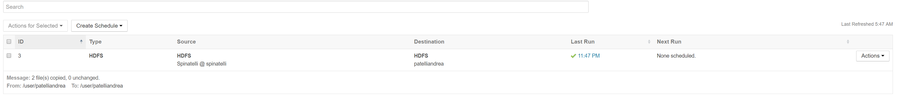

## Creation folders
The first step is to create two new users on the master node (padrinocluster1) and create their home directories on hdfs:
```
[ec2-user@ip-172-20-0-4 ~]$ sudo useradd patelliandrea
[ec2-user@ip-172-20-0-4 ~]$ sudo su - patelliandrea
[patelliandrea@ip-172-20-0-4 ~]$ hadoop fs -mkdir patelliandrea
[ec2-user@ip-172-20-0-4 ~]$ sudo useradd spinatelli
[ec2-user@ip-172-20-0-4 ~]$ sudo su - spinatelli
[spinatelli@ip-172-20-0-4 ~]$ hadoop fs -mkdir spinatelli
```

## Generation 500MB file
The following command has been executed in order to user `teragen` to create a 500MB file on the folder `/user/spinatelli/teragen_data`:
```
[spinatelli@ip-172-20-0-4 ~]$ hadoop jar /opt/cloudera/parcels/CDH-5.9.0-1.cdh5.9.0.p0.23/jars/hadoop-examples.jar teragen 5242880 /user/spinatelli/teragen
16/11/15 04:45:00 INFO Configuration.deprecation: session.id is deprecated. Instead, use dfs.metrics.session-id
16/11/15 04:45:00 INFO jvm.JvmMetrics: Initializing JVM Metrics with processName=JobTracker, sessionId=
16/11/15 04:45:00 INFO terasort.TeraSort: Generating 5242880 using 1
16/11/15 04:45:00 INFO mapreduce.JobSubmitter: number of splits:1
16/11/15 04:45:01 INFO mapreduce.JobSubmitter: Submitting tokens for job: job_local221604575_0001
16/11/15 04:45:01 INFO mapreduce.Job: The url to track the job: http://localhost:8080/
16/11/15 04:45:01 INFO mapreduce.Job: Running job: job_local221604575_0001
16/11/15 04:45:01 INFO mapred.LocalJobRunner: OutputCommitter set in config null
16/11/15 04:45:01 INFO output.FileOutputCommitter: File Output Committer Algorithm version is 1
16/11/15 04:45:01 INFO mapred.LocalJobRunner: OutputCommitter is org.apache.hadoop.mapreduce.lib.output.FileOutputCommitter
16/11/15 04:45:01 INFO mapred.LocalJobRunner: Waiting for map tasks
16/11/15 04:45:01 INFO mapred.LocalJobRunner: Starting task: attempt_local221604575_0001_m_000000_0
16/11/15 04:45:01 INFO output.FileOutputCommitter: File Output Committer Algorithm version is 1
16/11/15 04:45:01 INFO mapred.Task:  Using ResourceCalculatorProcessTree : [ ]
16/11/15 04:45:01 INFO mapred.MapTask: Processing split: org.apache.hadoop.examples.terasort.TeraGen$RangeInputFormat$RangeInputSplit@4d74a156
16/11/15 04:45:02 INFO mapreduce.Job: Job job_local221604575_0001 running in uber mode : false
16/11/15 04:45:02 INFO mapreduce.Job:  map 0% reduce 0%
16/11/15 04:45:06 INFO mapred.LocalJobRunner:
16/11/15 04:45:06 INFO mapred.Task: Task:attempt_local221604575_0001_m_000000_0 is done. And is in the process of committing
16/11/15 04:45:06 INFO mapred.LocalJobRunner:
16/11/15 04:45:06 INFO mapred.Task: Task attempt_local221604575_0001_m_000000_0 is allowed to commit now
16/11/15 04:45:06 INFO output.FileOutputCommitter: Saved output of task 'attempt_local221604575_0001_m_000000_0' to hdfs://ip-172-20-0-4.eu-central-1.compute.internal:8020/user/spinatelli/teragen/_temporary/0/task_local221604575_0001_m_000000
16/11/15 04:45:06 INFO mapred.LocalJobRunner: map
16/11/15 04:45:06 INFO mapred.Task: Task 'attempt_local221604575_0001_m_000000_0' done.
16/11/15 04:45:06 INFO mapred.LocalJobRunner: Finishing task: attempt_local221604575_0001_m_000000_0
16/11/15 04:45:06 INFO mapred.LocalJobRunner: map task executor complete.
16/11/15 04:45:07 INFO mapreduce.Job:  map 100% reduce 0%
16/11/15 04:45:07 INFO mapreduce.Job: Job job_local221604575_0001 completed successfully
16/11/15 04:45:07 INFO mapreduce.Job: Counters: 21
        File System Counters
                FILE: Number of bytes read=276325
                FILE: Number of bytes written=575901
                FILE: Number of read operations=0
                FILE: Number of large read operations=0
                FILE: Number of write operations=0
                HDFS: Number of bytes read=0
                HDFS: Number of bytes written=524288000
                HDFS: Number of read operations=4
                HDFS: Number of large read operations=0
                HDFS: Number of write operations=3
        Map-Reduce Framework
                Map input records=5242880
                Map output records=5242880
                Input split bytes=82
                Spilled Records=0
                Failed Shuffles=0
                Merged Map outputs=0
                GC time elapsed (ms)=52
                Total committed heap usage (bytes)=181403648
        org.apache.hadoop.examples.terasort.TeraGen$Counters
                CHECKSUM=11257830824958050
        File Input Format Counters
                Bytes Read=0
        File Output Format Counters
                Bytes Written=524288000
```
We can check if data has been correctly generated:
```
[spinatelli@ip-172-20-0-4 ~]$ hadoop fs -ls teragen
Found 2 items
-rw-r--r--   3 spinatelli supergroup          0 2016-11-15 04:45 teragen_data/_SUCCESS
-rw-r--r--   3 spinatelli supergroup  524288000 2016-11-15 04:45 teragen_data/part-m-00000
```
This file will be copied to `spinatelli` cluster by him using distcp.

I've copied the file generated by spinatelli on his cluster. Running `fsck` on the original file, outputs the following information:
```
[spinatelli@ip-172-0-0-4 ~]$ hadoop fsck /user/patelliandrea/teragen_data/part-m-00000 -files -blocks
DEPRECATED: Use of this script to execute hdfs command is deprecated.
Instead use the hdfs command for it.
Connecting to namenode via http://ip-172-0-0-4.eu-central-1.compute.internal:50070
FSCK started by spinatelli (auth:SIMPLE) from /172.0.0.4 for path /user/patelliandrea/teragen_data/part-m-00000 at Tue Nov 15 05:48:55 EST 2016
/user/patelliandrea/teragen_data/part-m-00000 524288000 bytes, 4 block(s):  OK
0. BP-1717843915-172.0.0.4-1479159419351:blk_1073743307_2483 len=134217728 Live_repl=3
1. BP-1717843915-172.0.0.4-1479159419351:blk_1073743308_2484 len=134217728 Live_repl=3
2. BP-1717843915-172.0.0.4-1479159419351:blk_1073743309_2485 len=134217728 Live_repl=3
3. BP-1717843915-172.0.0.4-1479159419351:blk_1073743310_2486 len=121634816 Live_repl=3
Status: HEALTHY
 Total size:    524288000 B
 Total dirs:    0
 Total files:   1
 Total symlinks:                0
 Total blocks (validated):      4 (avg. block size 131072000 B)
 Minimally replicated blocks:   4 (100.0 %)
 Over-replicated blocks:        0 (0.0 %)
 Under-replicated blocks:       0 (0.0 %)
 Mis-replicated blocks:         0 (0.0 %)
 Default replication factor:    3
 Average block replication:     3.0
 Corrupt blocks:                0
 Missing replicas:              0 (0.0 %)
 Number of data-nodes:          3
 Number of racks:               1
FSCK ended at Tue Nov 15 05:48:55 EST 2016 in 0 milliseconds
The filesystem under path '/user/patelliandrea/teragen_data/part-m-00000' is HEALTHY
```

After replicating, running `fsck` on the file on my cluster, outputs the following information:
```
[patelliandrea@ip-172-20-0-4 ~]$ hadoop fsck /user/patelliandrea/teragen_data/part-m-00000 -files -blocks
DEPRECATED: Use of this script to execute hdfs command is deprecated.
Instead use the hdfs command for it.

Connecting to namenode via http://ip-172-20-0-4.eu-central-1.compute.internal:50070
FSCK started by patelliandrea (auth:SIMPLE) from /172.20.0.4 for path /user/patelliandrea/teragen_data/part-m-00000 at Tue Nov 15 05:48:56 EST 2016
/user/patelliandrea/teragen_data/part-m-00000 524288000 bytes, 4 block(s):  OK
0. BP-567007794-172.20.0.4-1479156642241:blk_1073743420_2596 len=134217728 Live_repl=3
1. BP-567007794-172.20.0.4-1479156642241:blk_1073743421_2597 len=134217728 Live_repl=3
2. BP-567007794-172.20.0.4-1479156642241:blk_1073743423_2599 len=134217728 Live_repl=3
3. BP-567007794-172.20.0.4-1479156642241:blk_1073743424_2600 len=121634816 Live_repl=3

Status: HEALTHY
 Total size:    524288000 B
 Total dirs:    0
 Total files:   1
 Total symlinks:                0
 Total blocks (validated):      4 (avg. block size 131072000 B)
 Minimally replicated blocks:   4 (100.0 %)
 Over-replicated blocks:        0 (0.0 %)
 Under-replicated blocks:       0 (0.0 %)
 Mis-replicated blocks:         0 (0.0 %)
 Default replication factor:    3
 Average block replication:     3.0
 Corrupt blocks:                0
 Missing replicas:              0 (0.0 %)
 Number of data-nodes:          4
 Number of racks:               1
FSCK ended at Tue Nov 15 05:48:56 EST 2016 in 1 milliseconds


The filesystem under path '/user/patelliandrea/teragen_data/part-m-00000' is HEALTHY
```

To enable replication, you first have to click on cloudera manager on Backup->Peers and add a new peer:

After creating the peer, you can click on Backup->Replication Schedules and create a new replication schedule:

And then start the schedule:
