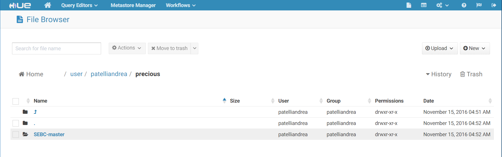
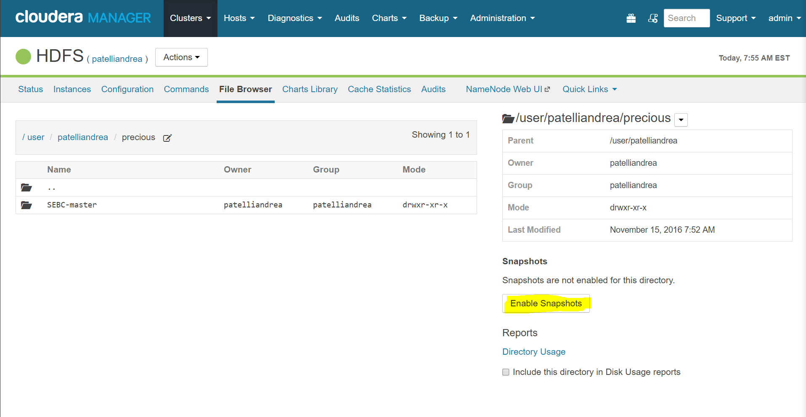
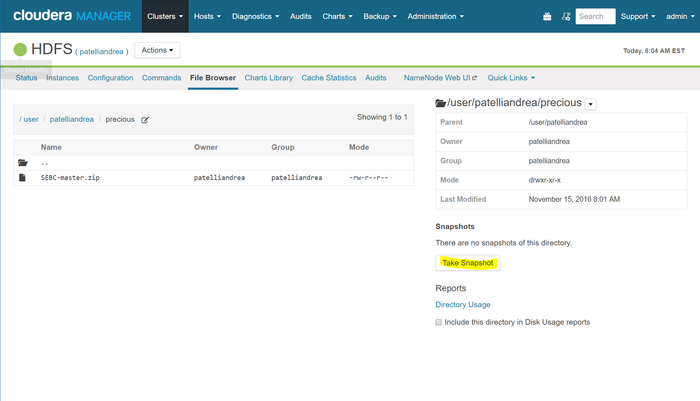
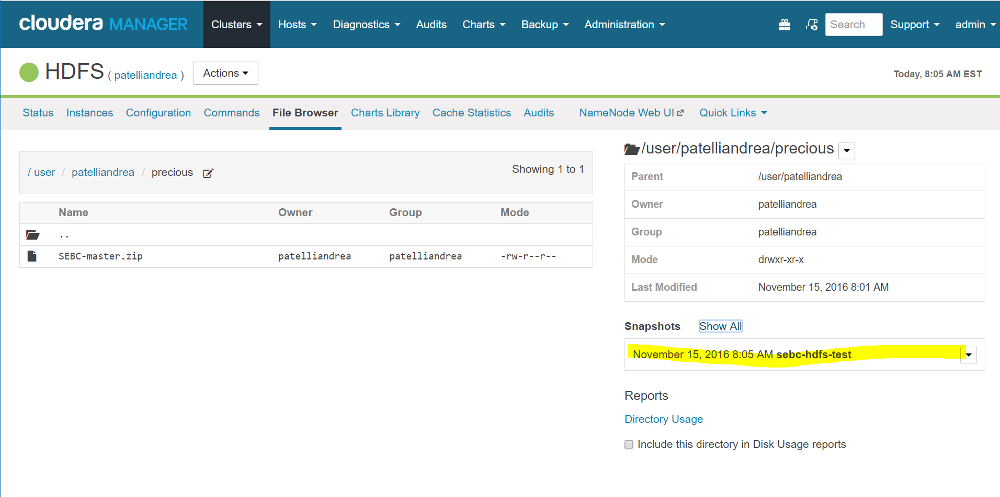
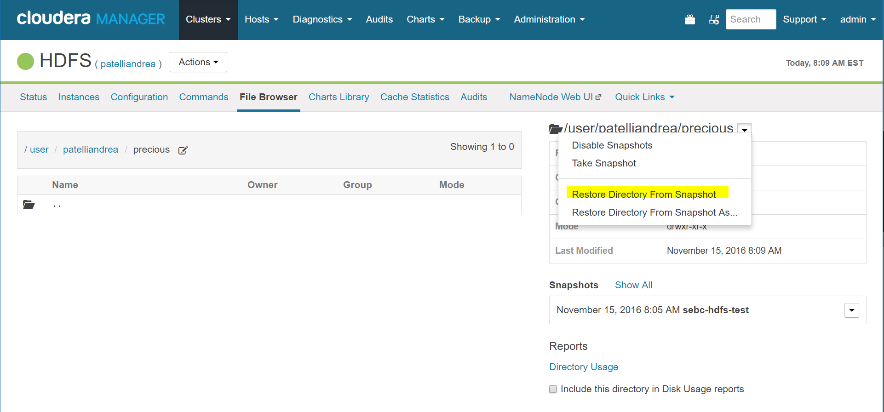
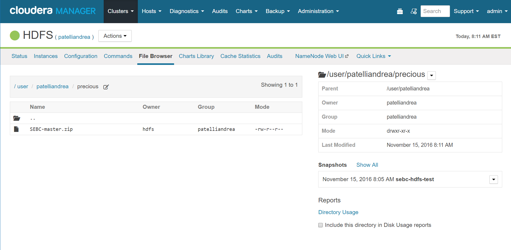

## HDFS Snapshots
The `precious` directory is created using Hue, as well as the upload of the zip file:


The first step is to make the folder snapshottable. To do that, using the navigator (http://padrinocluster1:7180/cmf/services/12/browse), simply navigate to the folder /user/patelliandrea/precious and click on "Enable Snapshots".


Once the folder is snapshottable, we can take a snapshot:


And check that the snapshot was taken correctly:


Is not possible to delete the folder since it's marked as snapshottable:
```
[patelliandrea@ip-172-20-0-4 ~]$ hadoop fs -rm -r precious
rm: Failed to move to trash: hdfs://ip-172-20-0-4.eu-central-1.compute.internal:8020/user/patelliandrea/precious: The directory /user/patelliandrea/precious cannot be deleted since /user/patelliandrea/precious is snapshottable and already has snapshots
```

Let's delete the file and check that it's been actually deleted:
```
[patelliandrea@ip-172-20-0-4 ~]$ hadoop fs -rm -r precious/SEBC-master.zip
16/11/15 08:09:09 INFO fs.TrashPolicyDefault: Moved: 'hdfs://ip-172-20-0-4.eu-central-1.compute.internal:8020/user/patelliandrea/precious/SEBC-master.zip' to trash at: hdfs://ip-172-20-0-4.eu-central-1.compute.internal:8020/user/patelliandrea/.Trash/Current/user/patelliandrea/precious/SEBC-master.zip
[patelliandrea@ip-172-20-0-4 ~]$ hadoop fs -ls precious
(no output)
```

To restore the folder content from the snapshot, we simply have to click on 'Restore Directory From Snapshot' from the navigator:


And as we can see, the zip file is restored:
